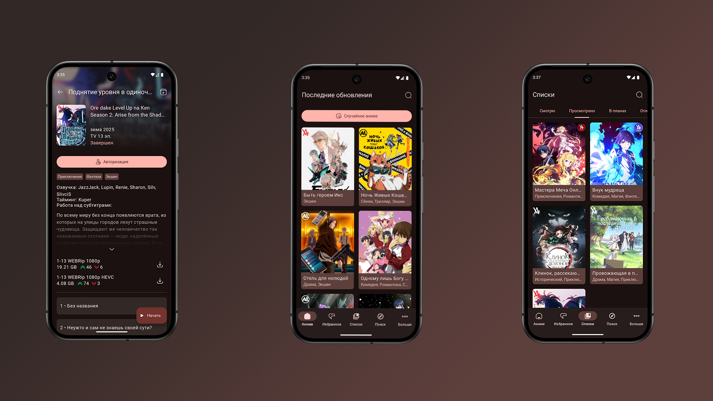

# LibertyNow

### Неофициальный андроид клиент для [AniLiberty](https://anilibria.top/)

## Features
- Большой выбор тайтлов с озвучкой от AniLiberty.
- Избранные - храни и отслеживай свои любимые аниме с помощью избранного.
- Списки - сортируй аниме по спискам.
- 6 красивых цветовых тем.
- Material 3 design - удобный и красивый дизайн на Material 3 от Google.
- Плеер со множеством удобных фич.
- Расширенный поиск, возможность искать тайтлы по множеству параметров.
## Main libraries
- [ViewModel](https://developer.android.com/topic/libraries/architecture/viewmodel)
- [Navigation](https://developer.android.com/guide/navigation)
- [Hilt](https://developer.android.com/training/dependency-injection/hilt-android)
- [Retrofit](https://square.github.io/retrofit/)
- [Jetpack Compose](https://developer.android.com/compose)
- [Coil](https://coil-kt.github.io/coil/compose/)
- [Room](https://developer.android.com/reference/androidx/room/package-summary)
- [Lottie](https://github.com/airbnb/lottie/blob/master/android-compose.md)
- [Paging](https://developer.android.com/jetpack/androidx/releases/paging)
- [Haze](https://chrisbanes.github.io/haze/latest/)
- [Material Design 3](https://m3.material.io/)
## Some issues
- РКН очень любит блокировать аниме сервисы, поэтому войти в аккаунт можно только с впн
- Также если у вас не грузятся какие-то данные, например картинки, попробуйте подключить впн или dpi спуфер
## App preview
https://github.com/user-attachments/assets/2eedc439-b503-49e0-929c-e30061b91116